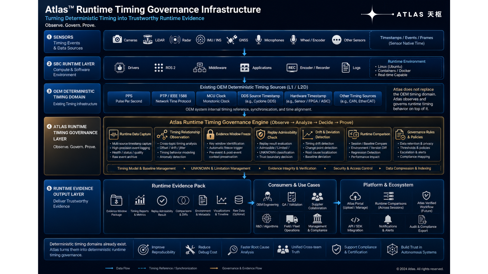

# Atlas Runtime

[](./LICENSE)
[](./RELEASE_SCOPE.md)
[](./docs/specifications/)
[](./docs/architecture/)

<p align="center">
  
</p>

Atlas Runtime is a runtime timing governance infrastructure for robotics and autonomous systems.

In simple terms:

Atlas helps engineering teams determine whether runtime timing behavior remains trustworthy during real deployment conditions.

Atlas does **not** replace your synchronization stack, middleware, ROS architecture, or timing infrastructure.

Instead, Atlas operates on top of existing systems to make runtime timing behavior:

- observable
- replay-traceable
- externally verifiable
- investigation-friendly

without requiring:

- code changes
- middleware replacement
- production downtime
- system rewrites

Atlas Runtime achieves this through replay-backed runtime evidence generation.

Every governance claim is intended to remain traceable to replay-verifiable runtime slices.

---

# Why Atlas Runtime Exists

Modern robotics systems increasingly depend on:

- GNSS / PPS timing
- PTP / IEEE 1588
- hardware timestamps
- sensor fusion timing
- ROS2 runtime behavior
- replay-driven debugging
- deterministic runtime assumptions

But in real deployment environments, runtime timing behavior often becomes difficult to explain, verify, or reproduce.

Common examples include:

## Same rosbag, different replay results

A bag replay behaves differently on different days or machines.

Engineering teams lose confidence in replay results.

---

## GNSS recovered, but localization still drifts

The PPS signal returns, but runtime timing behavior remains unstable.

---

## Timing degradation becomes invisible

Synchronization quality silently degrades during runtime.

---

## Runtime failures cannot be reproduced

A field issue happens once and disappears.

---

## OEM and supplier logs disagree

Different teams provide different runtime evidence.

Nobody can determine:

- what actually happened
- whether replay remains trustworthy
- which runtime windows remain admissible

---

# What Atlas Runtime Does

Atlas Runtime helps engineering teams investigate runtime timing behavior under real deployment conditions.

> These capabilities directly address the runtime problems described above.

## Replay Visibility Analysis

Determines whether runtime behavior remains replay-traceable under deterministic replay conditions.

Outputs include:

- replay admissibility state
- replay visibility windows
- replay limitation disclosures
- runtime evidence timelines

Specification:

- [Replay Visibility Specification](./docs/specifications/replay_visibility_spec.md)

---

## Authority Transition Tracking

Tracks runtime timing authority transitions including:

- PPS lock
- PPS recovery
- holdover
- degraded synchronization
- non-authoritative runtime operation

Specification:

- [Authority Boundary Specification](./docs/specifications/authority_boundary_spec.md)

---

## Runtime Evidence Generation

Generates replay-backed runtime evidence packages for:

- engineering investigation
- QA reproducibility
- supplier/OEM comparison
- deployment validation
- runtime governance review

Typical outputs include:

```text
evidence/
├── replay_report.html
├── evidence_windows.json
├── runtime_timeline.png
├── limitation_disclosure.json
└── metadata.json
```

Example schema:

```json
{
  "replay_id": "replay_20260527_001",
  "admissibility": "ADMISSIBLE",
  "windows": [
    {
      "type": "BASELINE_DEVIATION_WINDOW",
      "start_us": 1234567890,
      "end_us": 1234567900,
      "limitations": [
        "root_cause_not_determined"
      ]
    }
  ]
}
```

Specification:

- [Runtime Evidence Specification](./docs/specifications/runtime_evidence_spec.md)

---

## Drift & Deviation Observation

Observes runtime timing drift and deviation across runtime windows.

Examples include:

- PPS recovery instability
- clock drift accumulation
- runtime timing divergence
- baseline deviation detection

---

## Runtime Comparison Workflows

Supports comparison between:

- runtime sessions
- deployment environments
- baseline recordings
- supplier/OEM runtime evidence
- future Reference Domain runtime baselines

---

# Atlas Runtime Is NOT

Atlas Runtime is not:

- ❌ a ROS bag replay tool
- ❌ a time synchronization protocol
- ❌ a middleware replacement
- ❌ a logging dashboard
- ❌ a generic observability platform
- ❌ a sensor fusion framework
- ❌ a replacement for OEM timing infrastructure

Atlas operates above existing systems as a runtime timing governance layer.

---

# Technical Architecture

Atlas Runtime runs alongside existing robotics systems as a sidecar-style runtime governance layer.

```text
┌─────────────────────────────────────────┐
│           Robot Runtime Process         │
│                                         │
│  ┌─────────┐ ┌─────────┐ ┌─────────┐    │
│  │ Node A  │ │ Node B  │ │ Node C  │    │
│  └────┬────┘ └────┬────┘ └────┬────┘    │
│       └───────────┼───────────┘         │
│                   │ DDS / ROS2          │
└───────────────────┼─────────────────────┘
                    │
                    ▼
┌─────────────────────────────────────────┐
│         Atlas Runtime (Sidecar)         │
│                                         │
│ Observation → Analysis → Evidence       │
│                                         │
└─────────────────────────────────────────┘
```

Current public baseline architecture includes:

- ROS2/DDS runtime observation
- timestamp correlation
- replay visibility analysis
- authority state tracking
- runtime deviation analysis
- runtime evidence generation

Current deployment assumptions:

- Linux runtime environment
- ROS2-based systems
- x86 / ARM / Jetson-compatible
- non-invasive deployment workflow

---

# Performance Characteristics

Verified on:

- Jetson Orin
- x86_64 (Intel i7)
- ARM64 platforms

Current baseline targets:

| Metric | Target |
|---|---|
| Runtime overhead | <1% CPU |
| Memory footprint | <50MB |
| Deployment model | Sidecar / non-invasive |
| Runtime modification required | None |
| Middleware replacement required | None |
| Hardware modification required | None |

Measured on reference platforms. Results may vary with configuration.

---

# Quick Start

## 1. Clone the Repository

```bash
git clone https://github.com/sensordeck/atlas-runtime.git
cd atlas-runtime
```

---

## 2. Run Example Runtime Analysis

```bash
./scripts/validate_replay.sh --input ./examples/sample_recording.bag
```

Example output:

```text
Replay Visibility Result: ADMISSIBLE
Authority State: HOLDOVER
Runtime Drift Window: DETECTED

Evidence written to:
./output/evidence_2026-05-27/

├── replay_report.html
├── evidence_windows.json
├── runtime_timeline.png
└── limitation_disclosure.json
```

No code changes required.

No middleware replacement required.

No hardware modifications required.

---

## 3. Explore Runtime Examples

Examples are available under:

```text
examples/
```

Including:

- replay visibility examples
- runtime deviation examples
- controlled runtime events
- runtime comparison workflows
- limitation-preserving investigation examples

---

# Documentation

## Runtime Governance

- [Runtime Timing Governance](./docs/governance/runtime_timing_governance.md)
- [Runtime Truth Model](./docs/governance/runtime_truth_model.md)
- [Deterministic Claims](./docs/governance/deterministic_claims.md)

---

## Runtime Specifications

- [Replay Visibility Specification](./docs/specifications/replay_visibility_spec.md)
- [Authority Boundary Specification](./docs/specifications/authority_boundary_spec.md)
- [Runtime Evidence Specification](./docs/specifications/runtime_evidence_spec.md)

---

## Architecture

- [System Architecture](./docs/architecture/atlas_system_architecture.md)
- [Runtime Engine Architecture](./docs/architecture/runtime_engine_architecture.md)
- [Power + Timing Architecture](./docs/architecture/power_timing_architecture.md)

---

# ROS2 Support Matrix

| ROS2 Distro | Support Level |
|---|---|
| Humble | ✅ Supported |
| Iron | ✅ Supported |
| Rolling | 🟡 Experimental |
| Foxy | ⏳ Planned |

---

# FAQ

Common questions:

- [How is Atlas different from rosbag replay tools?](./docs/faq.md#vs-rosbag)
- [Does Atlas replace PTP or GNSS synchronization?](./docs/faq.md#sync)
- [Does Atlas require hardware changes?](./docs/faq.md#hardware)
- [Can Atlas determine root cause automatically?](./docs/faq.md#root-cause)
- [What ROS2 distributions are supported?](./docs/faq.md#ros2)
- [What hardware platforms are supported?](./docs/faq.md#platforms)
- [Are evidence package schemas versioned?](./docs/faq.md#schema)

See the [full FAQ](./docs/faq.md).

---

# Contributing

See [CONTRIBUTING.md](./CONTRIBUTING.md) for:

- adding governance rules
- extending evidence schemas
- submitting runtime examples
- contributing replay visibility workflows

---

# Release Status

Current public baseline:

```text
Atlas Runtime Public Governance Baseline
```

Current release scope includes:

- replay visibility semantics
- runtime evidence structures
- authority boundary definitions
- runtime investigation workflows
- deterministic replay boundaries
- limitation-preserving evidence concepts

Release details:

- [Release Scope](./RELEASE_SCOPE.md)
- [Acceptance Baseline](./ACCEPTANCE_BASELINE.md)

---

# Optional: Atlas Reference Domain

Atlas Runtime can optionally operate with Atlas Reference Domain infrastructure.

Reference Domain infrastructure adds:

- independent runtime observation
- independent timing validation
- runtime comparison baselines
- power + timing governance visibility

This enables advanced workflows such as:

```text
Verified Sensor Runtime
        ↕
OEM Runtime Evidence
        ↕
Reference Runtime Domain
```

---

# Intended Audience

Atlas Runtime is intended for:

- robotics platform engineers
- runtime validation teams
- autonomy infrastructure teams
- replay investigation engineers
- systems integration teams
- robotics OEM engineering teams
- sensor suppliers
- runtime certification participants
- runtime infrastructure architects

---

# License

Apache License 2.0

See `LICENSE` for details.